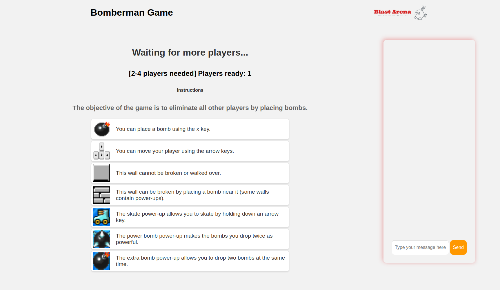
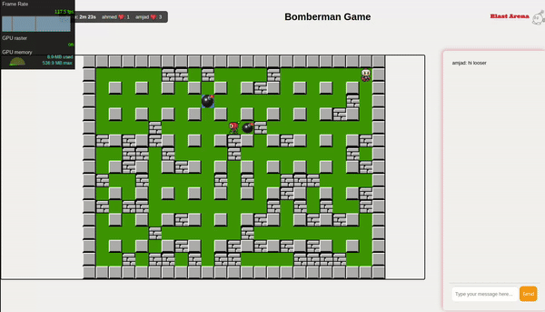
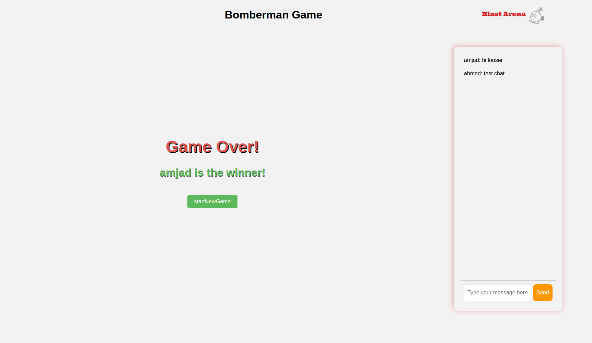

<p align="center">

    <h1 align="center">Bomberman Game</h1>
</p>

<h2 align="center">About The Project</h2>

Welcome to our Bomberman Game Project!

This project is a real-time multiplayer Bomberman game where players can move around a grid, place bombs, and try to eliminate other players. The game features WebSocket connections for real-time interactions, a chat system, and a countdown timer for game start. The frontend is built using a custom JavaScript framework, and the backend handles WebSocket connections and game state management.

## Table of Contents

-   [Getting Started](#getting-started)
-   [Usage](#usage)
-   [Preview](#preview)
-   [Authors](#authors)

## Getting Started

You can run the Bomberman Game project with the following command:

first install the dependencies:

```bash
npm install
```

then run the server:

```bash
cd 
node server.mjs
```

in the root directory run the client:
```bash
npm run dev
```

## Usage

### Controls

- **Arrow Keys**: Move your character up, down, left, or right.
- **x key**: Place a bomb.

### Game Rules

- **Objective**: Eliminate all other players by placing bombs.
- **Bombs**: Bombs explode in a cross pattern, destroying breakable walls and eliminating players in their path.
- **Power-Ups**: Collect power-ups to gain special abilities such as extra bombs, increased speed, or more powerful explosions.
- **Lives**: Each player starts with a set number of lives. When a player is hit by a bomb, they lose a life. The game ends when only one player remains or the timer runs out.

### Game Flow

1. **Lobby**: Players join the game lobby and wait for others to join.
2. **Lock-In**: Once enough players have joined, a countdown begins, allowing more players to join before the game starts.
3. **Game Start**: The game begins, and players can move around the grid, place bombs, and collect power-ups.
4. **Game End**: The game ends when only one player remains or the timer runs out. The player with the most lives remaining is declared the winner.

## Preview

Here are some screenshots of the game in action:
<details>
<summary>Game Lobby</summary>


</details>
<details>
<summary>Game in Progress</summary>


</details>
<details>
<summary>Game End</summary>


</details>

## Authors
-   [Amjad](https://github.com/amali01)
-   [Ahmed](https://github.com/AhmedAlAli9402)
-   [Sameer](https://github.com/sahmedG)
-   [Mohammed](https://github.com/MSK17A)
